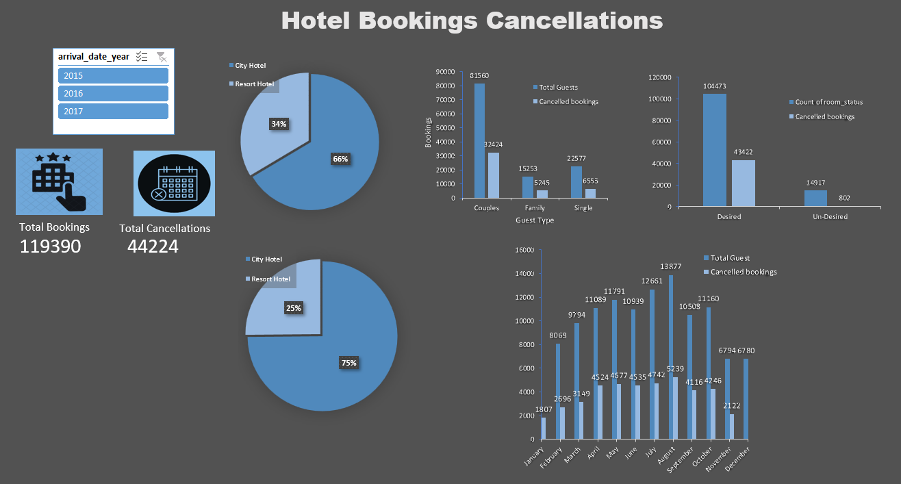

# Hotel Bookings & Cancellation Dashboard

An end-to-end interactive dashboard built entirely using **MS Excel** (no AI tools used) to analyze over 119K+ hotel booking records and discover insights behind cancellation patterns.

## 📊 Live Preview

## 🔑 Key Insights & Analytics
* **Segment Volume:** Couples contribute to the highest booking volume (~81K+) and also experience the highest absolute numbers of cancellations (~32K+).
* **Hotel Choice:** Distribution shows City Hotels capture a larger volume of bookings compared to Resort Hotels.
* **Seasonality:** Tracking cancellations across months (July to December) highlights seasonal peaks and drops in stakeholder revenue retention.

## 🛠️ Features Implemented
* **Interactive Slicers:** Dynamic filtering by `arrival_date_year` (2015, 2016, 2017).
* **Advanced Pivot Tables:** Efficient data modeling and data structure handling.
* **Custom UI Design:** Consistent color coding and custom KPI cards for visual clarity.

## 📂 How to Access
1. Download the repository's `.xlsx` file from the files section above.
2. Open it in MS Excel and use the slicers to experience the dynamic functionality.
